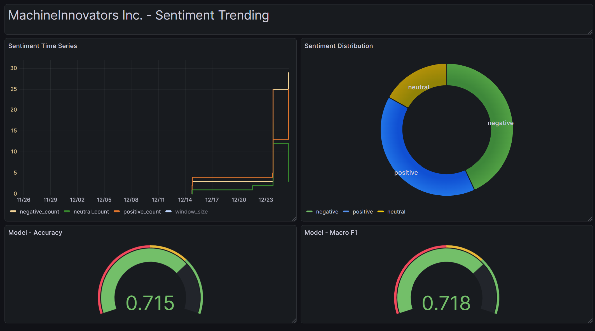

# ProfessionAI_Online_Reputation_Monitoring_Sentiment_Analysis
ProfessionAI Master AI Engineering. Progetto per il corso "MLOps e Machine Learning in Produzione"

# MachineInnovators – Online Reputation Monitoring

### Sentiment Analysis • FastAPI • MLOps • Grafana (Infinity) • Hugging Face

This project implements a complete Online Reputation Monitoring System using sentiment analysis on social media text.  
It is the final coursework for the *ProfessionAI Master in AI Engineering* (MLOps & Machine Learning in Production).

The system demonstrates production-ready MLOps practices:
- Pretrained Hugging Face sentiment model
- FastAPI inference service
- Time-series monitoring endpoints
- Grafana dashboards via Infinity plugin
- Scheduled retraining logic (stub) via GitHub Actions
- Dockerized architecture

---

## 1. Project Goal

MachineInnovators Inc. requires a scalable system to automatically analyze and track sentiment from social media.  
This project provides:

- Automated sentiment classification  
- Continuous monitoring of trends  
- Retraining pipeline planning when new labeled data appears  
- Integration with CI, orchestration tools, monitoring interfaces

---

## 2. Architecture Overview

        ┌──────────────────────────────┐
        │   Social Media Platforms     │
        └───────────────┬──────────────┘
                        │ text
                        ▼
              ┌──────────────────────┐
              │ FastAPI Inference API│
              │ /predict /stats      │
              └──────────┬───────────┘
                         │ JSON metrics
                         ▼
       ┌─────────────────────────────────────┐
       │ Grafana (Infinity Data Source)      │
       │ Time-series dashboards & alerts     │
       └─────────────────────────────────────┘
                         │ 
                         ▼
       ┌───────────────────────────────────────┐
       │                                       │
       │ Weekly retraining                     │
       └───────────────────────────────────────┘
                         │
                         ▼
      ┌─────────────────────────────────────┐
      │ GitHub Actions                      │
      │ - CI pipeline                       │
      │ - Scheduled retraining check        │
      └─────────────────────────────────────┘


**Grafana Infinity datasource** directly queries the `/stats` endpoint of FastAPI.  

---

# 3 - Sentiment Model

The project uses a Twitter-optimized RoBERTa model: https://huggingface.co/cardiffnlp/twitter-roberta-base-sentiment-latest

Model characteristics:
- Pretrained on millions of tweets
- Optimized for short, informal social media texts
- Outputs: **positive**, **neutral**, **negative**

---

# 4 - Project Structure

```text
.
├── src/
│   ├── app.py                # FastAPI endpoints
│   ├── model.py              # Hugging Face pipeline loader
│   ├── predict.py            # Prediction logic
│   ├── monitoring.py         # Time-series monitoring layer
│   ├── data.py               # Load new labeled data
│   └── retrain.py            # Retraining plan
│
├── data/
│   ├── monitoring/sentiment_log.csv      # Time-series log of predictions
│   └── new/                              # Future labeled datasets
│
├── scripts/
│   ├── evaluate_model.py      # Model Evaluatio
│
├── tests/
│   └── test_predict.py
│
├── Dockerfile
├── docker-compose.yml
├── requirements.txt
├── README.md
└── .github/
    └── workflows/
        ├── ci.yml             # tests + lint
        ├── cd.yml 
        └── retrain.yml        # scheduled retraining check


# 5 - Monitoring App Screenshot
